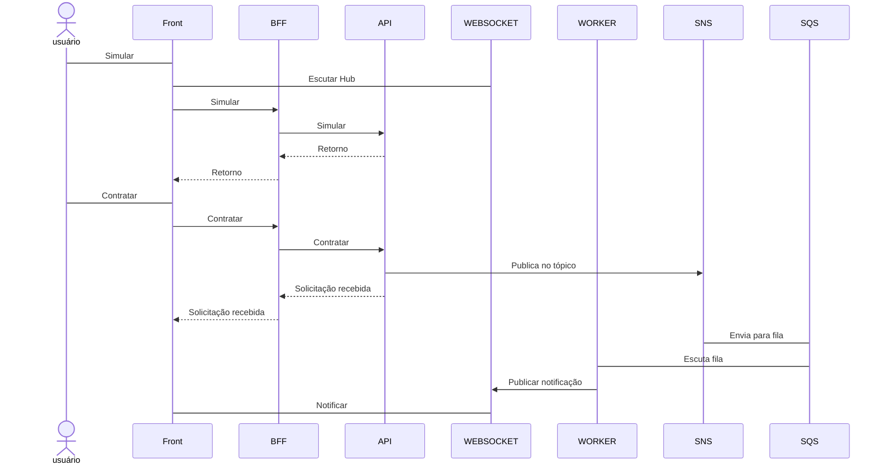

# Jornada com websocket (SignalR)

Projeto para demonstrar o fluxo de atualização de dados para usuários no front quando o processo de contratação/compra de um produto ou serviço é processada de forma assíncrona no backend da aplicação.

### Projeto Front
> Projeto onde o usuário vai interagir, consultar, simular e contratar produtos os serviços. 
> Este projeto se conecta no servidor websocket utilizando a biblioteca @microsoft/signalR e faz chamadas HTTP para o seu BFF. 
> |Tecnologia | Versão |
>|-----------|-------------|
> |Angular | 19 |
> |Angular Material | 19 |
> |SignalR | 8.0.7 |

### Projeto BFF
> Projeto responsável por orquestrar, compor e formatar os dados das API's internas em um forma para que o front utilize de forma mais simples.
> |Tecnologia | Versão |
>|-----------|-------------|
>| .Net | 8 |
>| OpenTelemetry | 1.9 |

### Projeto API
> Projeto responsavel por receber e validar as requisições para simular e comprar/contratar um produto ou serviço, para efetuar a compra/contratação ele apenas valida os dados e posta em um tópico **AWS SNS** para que os demais serviços interessados façam os processamentos necessários para que a solicitação seja efetivada.
> |Tecnologia | Versão |
>|-----------|-------------|
>| .Net | 8 |
>| OpenTelemetry | 1.9|
>| AWS.Messaging | 0.9.2 |
>| AWSSDK.Extensions.NETCore.Setup | 3.7.301|
>| AWSSDK.SimpleNotificationService | 3.7.400|
>| LocalStack.Client | 1.5 |
>| LocalStack.Client.Extensions | 1.3 |

### Projeto Websocket
> Projeto responsável pelo serviço de websocket que notifica o usário quando algum evento ocorre ao pedido dele.
> |Tecnologia | Versão |
>|-----------|-------------|
>| .Net | 8 |
>| OpenTelemetry | 1.9 |
>| Microsoft.AspNetCore.SignalR.StackExchangeRedis | 8.0.11 |

### Projeto Worker
> Projeto responsável por processar as mensagens na fila **AWS SQS** para efetivar a solicitação do usuário e postar a notificação para o cliente no Websocket.
> |Tecnologia | Versão |
>|-----------|-------------|
>| .Net | 8 |
>| OpenTelemetry | 1.9|
>| AWS.Messaging | 0.9.2 |
>| AWSSDK.Extensions.NETCore.Setup | 3.7.301|
>| AWSSDK.SQS | 3.7.400 |
>| LocalStack.Client | 1.5 |
>| LocalStack.Client.Extensions | 1.3 |

### Projeto Aspire
> Dashboar para acompanhar os dados dos projetos .Net e Angular que compões a solução

### Projeto ServiceDefaults
> Projedo para adocionar as dependencias do Opentelemetry e configurar o envio dos dados para o Dashboard do ASPIRE

### Outras Depências no docker compose
> **LocalStack** Para simular localmente serviços AWS como SNS, SQS e API Gateway.  
> **Redis** Para apoiar o projeto websocket caso seja necessário escalar horizontalmente e não não perder o controle dos usuários conectando em cada uma das instancias, e também utilizado para controlar o ID do usuário com o ID da conexão dele com hubwebsocket e poder notificar corretamente cada usuário sobre seu pedido. 

### Fluxo de dados
